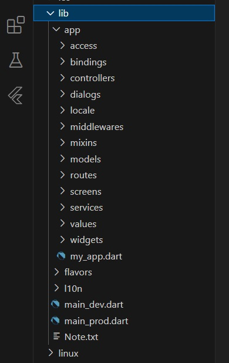

# Flutter Template for Drupal CMS (Getx, MVVM)

 Flutter Getx template follows [MVVM](https://en.wikipedia.org/wiki/Model%E2%80%93view%E2%80%93viewmodel) (Model View ViewModel) architectural pattern to build a robust and clean App that integrates all functionality of Drupal Using REST API(JSONAPI core module), In this project I used the powerful features of Getx like state management, Dependency injection, route management.
## Features
 * Multilingual, Drupal localization integrated with flutter localizations
 *  [Material Theme Builder](https://m3.material.io/theme-builder)
 *   Dark and Light themes
 *  Role-based access control (RBAC) (Hide Routes and Buttons from the App depending on permissions and roles)
 *  Authorization and Authentication using the [Oauth2](https://oauth.net/2/) protocol
 *  Membership
 *  Nodes management CRUD
 *  Taxonomies management CRUD  with parent hierarchy
 *  Taxonomy field reference 
 *  Images field with multiple upload ability
 *  Use Flutter [Getx](https://pub.dev/packages/get) package
 *  All [Drupal](https://drupal.org/) functionality implemented using  [JSON:API](https://www.drupal.org/docs/core-modules-and-themes/core-modules/jsonapi-module/api-overview)
 *  Development and production modes
## Architecture 
 

# run this project by command line
Dev: `flutter run --flavor dev lib/main_dev.dart`

Prod: `flutter run --flavor prod lib/main_prod.dart`


## Flutter Version
``````
PS > flutter --version
Flutter 3.7.8 • channel stable • https://github.com/flutter/flutter.git
Framework • revision 90c64ed42b (12 months ago) • 2023-03-21 11:27:08 -0500
Engine • revision 9aa7816315
Tools • Dart 2.19.5 • DevTools 2.20.1
``````
## Dependencies:
``````
  flutter:
    sdk: flutter
  flutter_localizations:
    sdk: flutter
  intl: ^0.17.0

  # The following adds the Cupertino Icons font to your application.
  # Use with the CupertinoIcons class for iOS style icons.
  cupertino_icons: ^1.0.2
  get: ^4.6.5
  equatable: ^2.0.3
  http: ^0.13.4
  internet_connection_checker: ^0.0.1+3
  oauth2: ^2.0.0
  webview_flutter: ^4.4.2
  chips_input: ^0.1.0
  lazy_load_scrollview: ^1.3.0
  flutter_slidable: ^2.0.0
  wp_search_bar: ^0.1.4
  multi_select_flutter: ^4.1.3
  google_fonts: ^4.0.3
  skeletons: ^0.0.3
  image_field: ^0.0.8
  image_picker: ^1.0.4
  scrollable_positioned_list: ^0.3.8  
  carousel_slider: ^4.2.1
  shared_preferences: ^2.2.2
  path_provider: ^2.1.1
  timezone: ^0.9.2
  logger: ^2.1.0
``````

## How to update app information and continue development for your own project?

1. Rename root folder name
2. Update project name and description from pubspec.yaml. 
3. Update app launcher name and icon. [Reference](https://medium.com/@vaibhavi.rana99/change-application-name-and-icon-in-flutter-bebbec297c57)
4. Update your app's package name by [running this command](https://pub.dev/packages/change_app_package_name):

`flutter pub run change_app_package_name:main your_package_name`

## Installation
1. Download Flutter version mentioned above
2. Clone the project

3. Open`````` lib  > main_dev.dart``````  then set the variables
``````
  //Example: https://www.example.com without /
  baseUrl = '';
  ``````
  Open`````` lib  > main_prod.dart``````  then set the variables
   ``````
  //Example: https://www.example.com without /
  baseUrl = '';
  ``````

4.  In the same file `````` lib > app > services > auth_api_service.dart.dart``````  set the Client Id and Client Secret of your app
``````
  static const String clientId = 'CLIENT_ID';
  static const String clientSecret = 'CLIENT_SECRET';
``````
