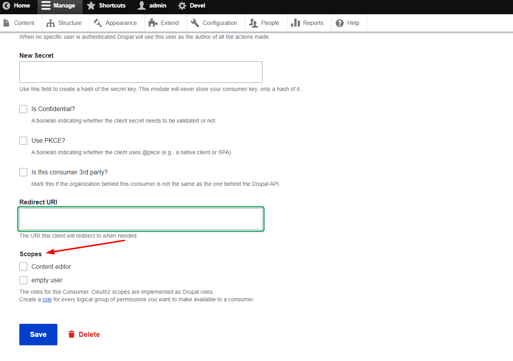

# Install Drupal from scratch (First method)
* [Download webserver files](./flutter_drupal_web.zip) then upload it to your web server ([Web server requirements](https://www.drupal.org/docs/getting-started/system-requirements/web-server-requirements))
* [Download database file](./flutter_drupal_web.zip) then import it into your database server ([Database server requirements](https://www.drupal.org/docs/getting-started/system-requirements/database-server-requirements))

# Update existing Drupal Web App (Second method)
### 1-Install the following modules by adding them to the composer.json
````
  "require": {
       .........
        "drupal/backup_migrate": "^5.0",
        "drupal/core-composer-scaffold": "^9.5",
        "drupal/core-project-message": "^9.5",
        "drupal/core-recommended": "^9.5",
        "drupal/devel": "^5.0",
        "drupal/jsonapi_response_alter": "^1.2",
        "drupal/restui": "^1.21",
        "drupal/simple_oauth": "^5.2"
    },
`````
### 2-Install the contributed modules by download [./flutter_drupal_web.zip](./flutter_drupal_web.zip)
  then extract the file and go to web > modules > custom
  then copy them to your project
  then [enable modules](https://www.drupal.org/docs/extending-drupal/installing-modules) by interface or command line


### 3-Install and configure module [simple oauth 5.2](https://www.drupal.org/project/simple_oauth) that already added in the point 1
after that you should apply this [patch](https://www.drupal.org/files/issues/provide_default_scopes-2857930-2.patch), [why we apply this patch](https://www.drupal.org/project/simple_oauth/issues/3416173)

In order to configure the module watch the following tutorial and read the note in the point 4 before
 [](https://www.youtube.com/watch?v=rAf5l_tPMzg)
     
### 4-Note in this version of module simple oauth 5.2 the scopes is moved to client(consumer)
we should let all of them uncheck in order to get the roles that exist in account.
   

### 5-Go to the services.yml in your project following the below path

    > web > sites > default > services.yml
    
    Then add at the end the following snipped code

    ````
    simple_oauth.openid.claims:
        - sub
        - name
        - preferred_username
        - email
        - email_verified
        - locale
        - profile
        - updated_at
        - zoneinfo
        - uuid
        - roles
        - permissions
    ````


### 6-Enable the web services modules
click on the extend on the menu or go to the path ```/admin/modules``` scrolldown to Web Services section and enable all the modules

  


### 7-Configure jsonpai by going to the path ```/admin/config/services/jsonapi```
then select ```Accept all JSON:API create, read, update, and delete operations.```

   


### 7-Configure REST resources by going to the path ```/admin/config/services/rest```
then enable User with GET method
and User registration with POST mehtod

   

### 8-Create a Role ```content editor``` and assign to him the following permissions (permissions page path: admin/people/permissions):
* Article: Create new content
* Article: Delete own content
* Article: Edit own content
* Basic page: Create new content
* Basic page: Delete own content
* Basic page: Edit own content
* Access the Content overview page
* Administer content
* View published content
* View own unpublished content
* Administer URL aliases
* Create and edit URL aliases
* Tags: Create terms
* Tags: Edit terms
* Tags: Delete terms
* Access the taxonomy vocabulary overview page
* Administer users
* View user information
* jsonapi view own permissions
* jsonapi view own roles

Then assign the following permissions to the authenticated user:
 * Grant OAuth2 codes

 # Enable Multilingual
 ### 1-First enable all multilingual modules by going to Extend or path ```admin/modules```  in Multilingual section then select all modules.

 ### 2-Add a language using the path ```admin/config/regional/language```

 ### 3-Configure ```Content Translation``` using the path ```admin/config/regional/content-language```
  * you can enable ```Content``` and ```URL alias```
 
 ### Translate node by going to the path ```admin/structure/types``` then edit the node type that you want to translate then scroll down to ```Language settings``` then check the following options:
 * Show language selector on create and edit pages
 * Enable translation