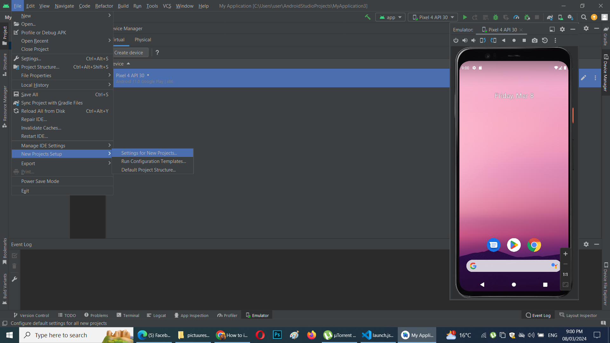
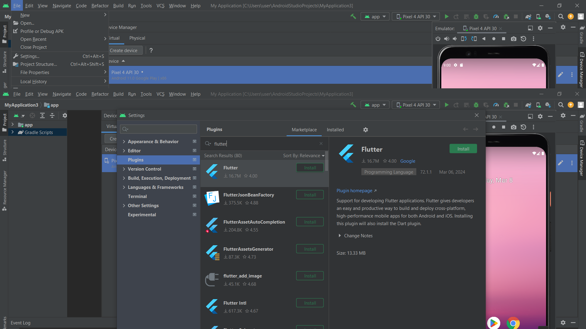
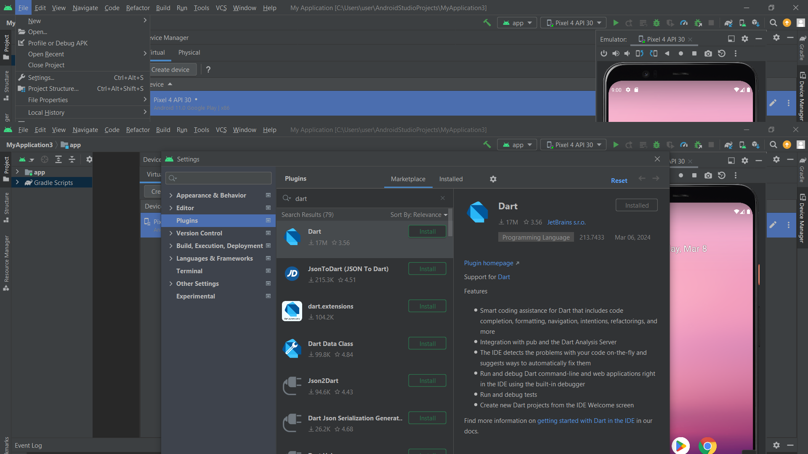
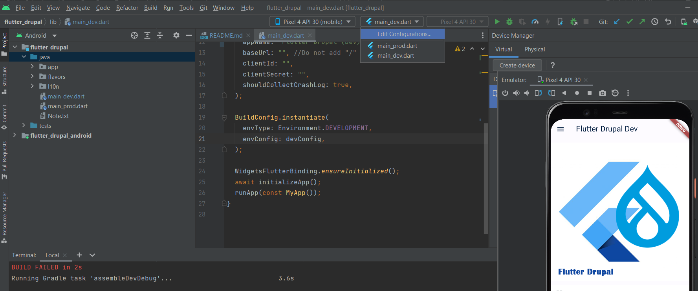
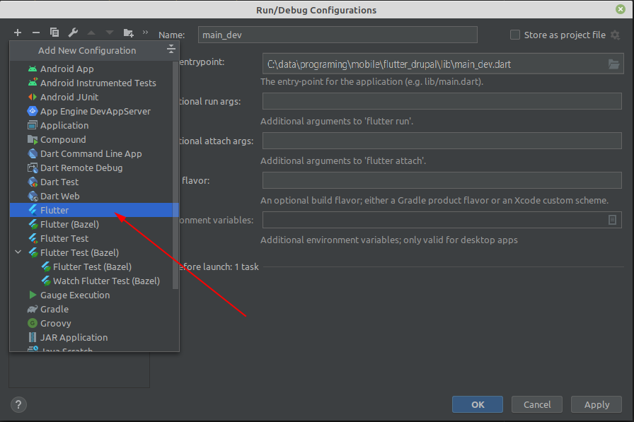
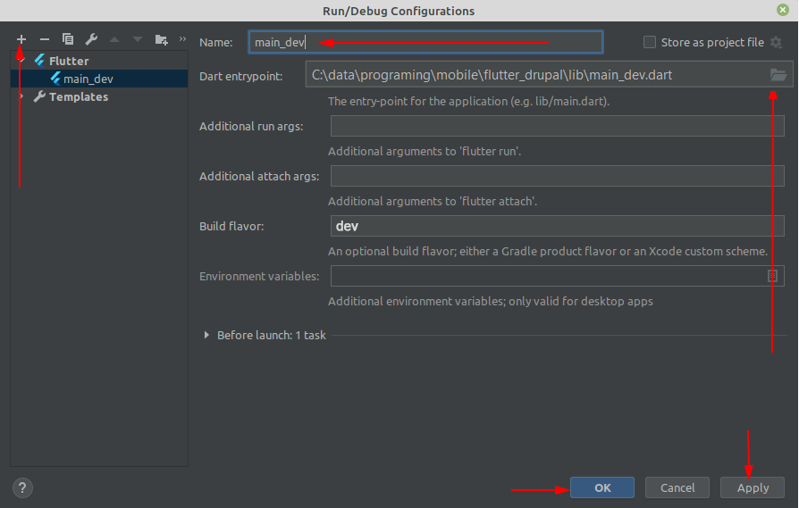
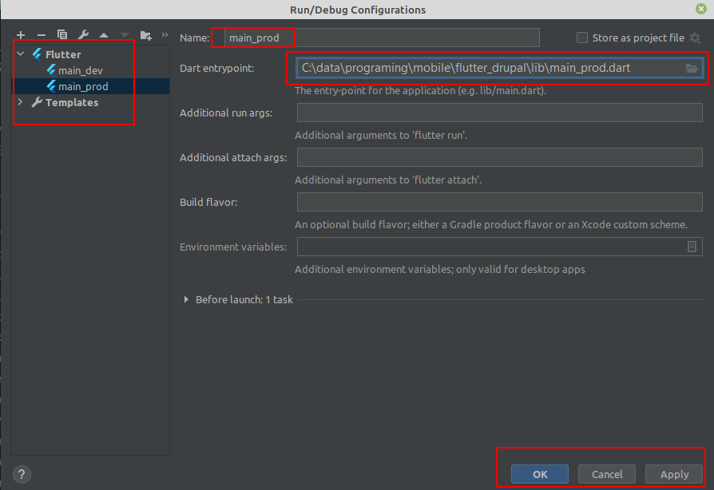

# How to configure and run this project on Android Studio?
 * First of all open your project using Android studio IDE
  

 * Then Install flutter and Dart Plugin

 * Open settings File > New projects setup > Settings for new projects
  

  * Install Flutter
  

  Install Dart
  

### After you done from the previous steps you need to add the flaviors(Production, development) by using the following steps:
**Step 1:** First of all click "Add/Edit Configurations" as like image 1:



**Step 2:** Choose "Flutter" from configuration list and select your Dart entrypoint path according
to your flavor then give a name and allow dart support for this project. See on Image 2, 3

* Image 2



* Image 3

)

**Step 3:** Create another configuration for prod following two steps above:

)


# How to configure and make android release build for production
Release build can be made using `flutter build <options> apk` command. Before that create a **key.properties** file in the **android** folder. Add folloiwng lines to that file:
```
keyAlias=<your keystore alias>
password=<your keystore password>
storeFile=<path to the keystore file>
```
Then run `flutter build appbundle -t lib/main_prod.dart --flavor prod` to generate app bundle (.aab) file. To generate .apk file, run `flutter build apk -t lib/main_prod.dart --flavor prod`.

For more details, please read through guide to build and relase android app documentation from [this link](https://docs.flutter.dev/deployment/android).